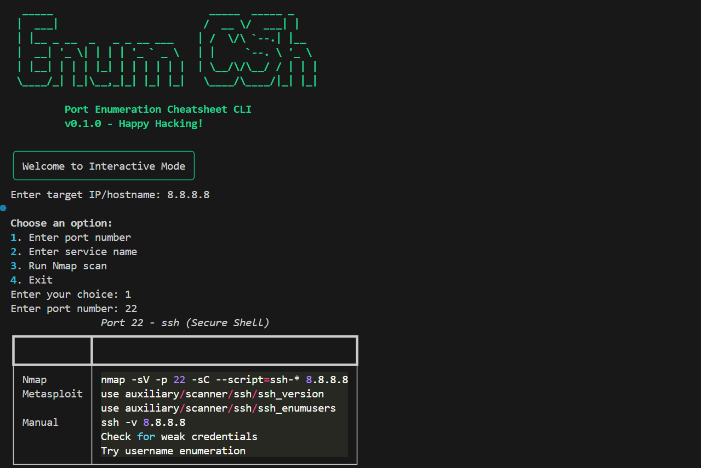
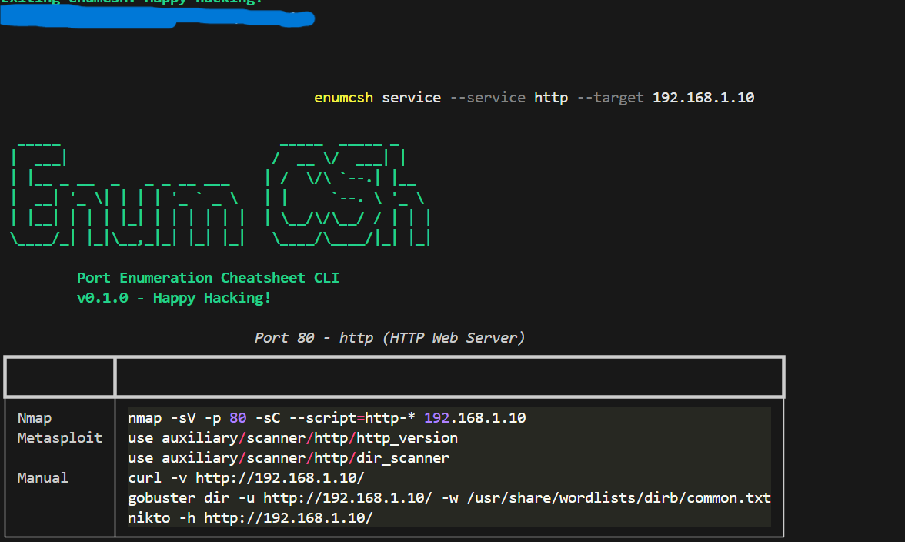
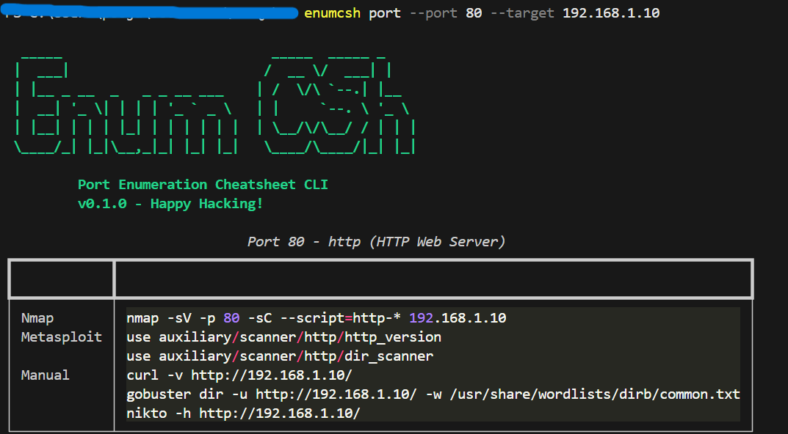

# enumCSh

```
  _____                          _____  _____ _     
 |  ___|                        /  __ \/  ___| |    
 | |__ _ __  _   _ _ __ ___    | /  \/\ `--.| |__  
 |  __| '_ \| | | | '_ ` _ \   | |     `--. \ '_ \ 
 | |__| | | | |_| | | | | | |  | \__/\/\__/ / | | |
 \____/_| |_|\__,_|_| |_| |_|   \____/\____/|_| |_|
                                                    
         Port Enumeration Cheatsheet CLI
```

A CLI tool that automates and simplifies port enumeration for penetration testing. It functions as an interactive cheatsheet on the command line for known and unknown ports.

## Features

- Provides Nmap and Metasploit command templates based on a given port or service name
- Includes enumeration templates for common ports (21, 22, 23, 25, 80, 443, 3306, etc.)
- Supports "unknown" ports with a generic template suggestion
- Allows users to input either a list of ports or scan output
- Optional execution of the suggested command with confirmation
- Supports CLI arguments such as `--port 80`, `--service ftp`, or interactive mode
- Uses Typer for CLI and Rich for terminal output styling
- Extensible templates via JSON configuration
- Packaged as an installable Python tool that can run on Kali Linux and Windows

## Installation

### Prerequisites

- Python 3.6 or higher
- pip (Python package manager)
- Nmap (optional, for scanning functionality)

### Windows Installation

```bash
# Clone the repository
git clone https://github.com/yourusername/enumcsh.git
cd enumcsh

# Run the installation script
install.bat

# Or install manually
pip install --user -e .
```

### Linux/macOS Installation

```bash
# Clone the repository
git clone https://github.com/yourusername/enumcsh.git
cd enumcsh

# Run the installation script
chmod +x install.sh
./install.sh

# Or install manually
pip3 install -e .
```

## Usage

### Command Line Arguments

```bash
# Enumerate a specific port
enumcsh port --port 80 --target 192.168.1.10

# Enumerate a specific service
enumcsh service --service http --target 192.168.1.10

# Run a scan and get enumeration suggestions
enumcsh scan --target 192.168.1.10

# Run in interactive mode
enumcsh interactive
```

### Interactive Mode

Interactive mode provides a menu-driven interface for using the tool:

1. Enter target IP/hostname
2. Choose from options:
   - Enter port number
   - Enter service name
   - Run Nmap scan
   - Exit

### Custom Templates

You can customize the enumeration templates by editing the `templates.json` file that is created in the same directory as the script. The file structure is as follows:

```json
{
  "ports": {
    "80": {
      "service": "http",
      "description": "HTTP Web Server",
      "nmap": "nmap -sV -p 80 -sC --script=http-* {target}",
      "metasploit": [
        "use auxiliary/scanner/http/http_version",
        "use auxiliary/scanner/http/dir_scanner"
      ],
      "manual": [
        "curl -v http://{target}/",
        "gobuster dir -u http://{target}/ -w /usr/share/wordlists/dirb/common.txt",
        "nikto -h http://{target}/"
      ]
    }
  },
  "services": {
    "http": "80"
  }
}
```

## Troubleshooting

### Command Not Found

If you get a "command not found" error when trying to run `enumcsh`, try one of these solutions:

1. Make sure the installation completed successfully
2. Use the full path to the script: `python /path/to/enumcsh.py`
3. Use the provided batch file: `enumcsh-run.bat` (Windows)
4. Add the installation directory to your PATH

### Missing Dependencies

If you encounter errors about missing modules, install them manually:

```bash
pip install typer rich click shellingham typing-extensions markdown-it-py pygments mdurl
```

## Development

### Project Structure

```
enumcsh/
├── enumcsh.py         # Main script
├── templates.json     # Enumeration templates
├── setup.py          # Package setup
├── install.bat       # Windows installation script
├── install.sh        # Linux/macOS installation script
└── test_enumcsh.py   # Unit tests
```

### Running Tests

```bash
python -m unittest test_enumcsh.py
```

## How Amazon Q Developer Assisted in Creating This Tool

Amazon Q Developer was instrumental in developing the enumCSh tool, providing assistance in several key areas:

1. **Initial Code Structure**: Q Developer helped design the overall architecture of the CLI tool, suggesting the use of Typer for command-line interface and Rich for terminal styling.

2. **Template System**: Q Developer implemented the JSON-based template system that makes the tool extensible and easy to customize.

3. **Command Execution**: Q Developer added the ability to execute suggested commands with user confirmation, enhancing the tool's practical utility.

4. **Interactive Mode**: Q Developer created the interactive menu-driven interface that makes the tool accessible to users who prefer guided operation.

5. **Cross-Platform Compatibility**: Q Developer ensured the tool works on both Windows and Linux systems, providing appropriate installation scripts for each platform.

6. **ASCII Art Integration**: Q Developer added the ASCII art banner to give the tool a professional and visually appealing interface.

7. **Troubleshooting**: When installation issues arose, Q Developer provided solutions and updated the setup process to ensure all dependencies were properly installed.

8. **Documentation**: Q Developer created comprehensive documentation including installation instructions, usage examples, and customization guidance.

The collaboration with Amazon Q Developer significantly accelerated the development process, allowing for rapid prototyping and implementation of features while maintaining code quality and user experience.

## Requirements

- Python 3.6+
- Typer
- Rich
- Click
- Shellingham
- Typing-extensions
- Markdown-it-py
- Pygments
- Mdurl
- Nmap (for scanning functionality)

## 🔍 Proof of Work

Here are screenshots showing the working implementation of `enumCSh`:

### 🖼️ Screenshot 1 – CLI Command Execution


### 🖼️ Screenshot 2 – Output View


### 🖼️ Screenshot 3 – Interactive Usage

